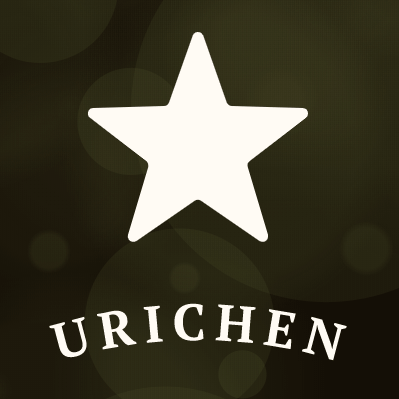

<p align="center">
  
</p>

## 总览

vue + typescript模板(自用)，它基于 [vue](https://github.com/vuejs/vue), [typescript](https://www.typescriptlang.org/), [tailwindcss](https://www.tailwindcss.cn/), [sentry](https://docs.sentry.io/)等实现。

## 功能

```txt
- vue全家桶最新版本集成
  - 所有依赖全部使用最新版本
  - typescript 最新版本
  - babel + browserslistrc 自动转换esnext语法
  - 最新语法提案支持(optional-chaining等)
  - vuex 模块动态注册
  - vuex 数据本地化(vuex-persistedstate) 加密存储

- API请求二次封装
  - axios
  - 请求错误统一处理
  - async await
  - await-to js
  - 页面切换自动取消进行中的请求
  
- 浏览器不兼容时自动弹出升级提示
  - 插件位于public/upgrade-your-browser,可更改需要提示的浏览器版本

- 权限验证
  - 路由导航
  - 页面权限
  - 指令权限
  - 权限配置

- 多环境发布
  - Dev / Stage / Prod

- 全局功能
  - 国际化多语言
  - 动态换肤
  - Svg 图标
  - 设置
  - Mock 数据 / Mock 服务器
  
- sentry前端异常监控
  - 自动部署
  - 发生bug时动态注册组件
  - bug通知到电子邮箱
  - source map 自动上传到sentry服务器,自动删除线上source map
  
- tailwindcss
  - postcss配置
  - purgecss自动清除未使用css代码
  
- eslint 代码检查

```

## 前序准备

你需要在本地安装 [nodejs](http://nodejs.org/), 包管理工具[yarn](https://www.yarnpkg.com/lang/en/)

本项目技术栈基于 [typescript](https://www.typescriptlang.org/)、[vue](https://cn.vuejs.org/index.html)、[vuex](https://vuex.vuejs.org/zh-cn/)、[vue-router](https://router.vuejs.org/zh-cn/) 、[vue-cli](https://github.com/vuejs/vue-cli) 、[axios](https://github.com/axios/axios)

使用[tailwindcss](https://www.tailwindcss.cn/)优化css文件体积

使用[sentry](https://docs.sentry.io/)进行线上bug监控


本项目使用[eslint](https://eslint.bootcss.com/)作为代码检测工具

IDE工具强烈推荐使用[webstorm](https://www.jetbrains.com/webstorm/) 2019.3以上的版本 和[vscode](https://code.visualstudio.com/)

如果你第一次使用[webstorm](https://www.jetbrains.com/webstorm/),那么我推荐你导入我提供的配置文件(项目目录下的webstorm_settings.zip),以节省IDE配置时间

## 目录结构

```bash
├── mock                       # mock 服务器
├── public                     # 静态资源
│   │── static                 # 静态资源目录
│   │── upgrade-your-browser   # 提示用户升级浏览器的插件(需在index.html注入)
│   │── favicon.ico            # favicon图标
│   └── index.html             # html模板
├── src                        # 源代码
│   ├── api                    # 所有请求
│   ├── assets                 # 主题 字体等静态资源 (由 webpack 处理加载)
│   ├── components             # 全局组件
│   ├── directive              # 全局指令
│   ├── filters                # 全局过滤函数
│   ├── icons                  # svg 图标
│   ├── lang                   # 国际化
│   ├── layouts                # 全局布局
│   ├── plugins                # 全局插件
│   ├── router                 # 路由
│   ├── store                  # 全局 vuex store
│   ├── styles                 # 全局样式
│   ├── utils                  # 全局方法
│   ├── views                  # 所有页面
│   ├── App.vue                # 入口页面
│   ├── main.js                # 入口文件 加载组件 初始化等
│   ├── permission.ts          # 权限管理
│   ├── settings.ts            # 设置文件ts版导出用
│   │   └─── settings.js       # 设置文件js
│   └── shims.d.ts             # 模块注入
├── tests                      # 测试
├── .browserslistrc            # browserslistrc 配置文件
├── .editorconfig              # 编辑器相关配置
├── .env.xxx                   # 环境变量配置
├── .eslintrc.js               # eslint 配置
├── .sentryclirc               # sentry前端异常监控 配置
├── alias.config.js            # 路径别名 配置(使用webstorm IDE时需要将其设置为webpack配置文件才能正确解析路径别名)
├── babel.config.js            # babel-loader 配置
├── jest.config.js             # jest 单元测试配置
├── tailwind.config.js         # tailwind 配置
├── package.json               # package.json 依赖
├── postcss.config.js          # postcss 配置
├── tsconfig.json              # typescript 配置
└── vue.config.js              # vue-cli 配置
```

## 如何设置以及启动项目

### 安装依赖

### 请使用yarn作为包管理
```bash
npm install yarn -g
```

```bash
yarn install
```

### 启动mock服务器
```bash
yarn mock
```

### 启动本地开发环境（自带热启动）

```bash
yarn dev
```

### 构建生产环境 (自带压缩)

```bash
yarn build
```

### 代码格式检查以及自动修复

```bash
yarn lint
```

### 运行单元测试

```bash
yarn test:unit
```

### 自动生成 svg 组件(重要: 添加svg文件后请运行一次)

```bash
yarn run svg
```

### 自定义 Vue 配置

请看 [Configuration Reference](https://cli.vuejs.org/config/).

## 项目负责人
urichen9606@gmail.com
